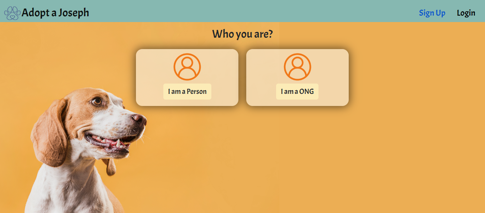
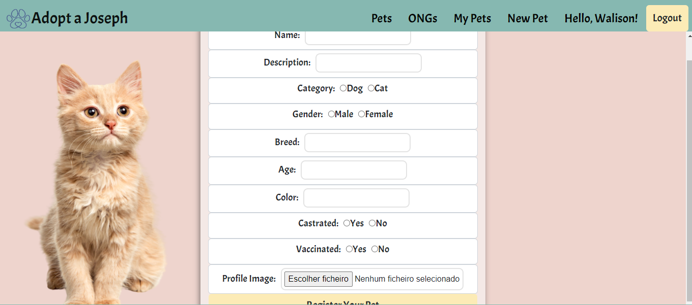

!
# Adopt a Joseph

# Índice 

* [Adopt a Joseph](#Adopt-a-Joseph)
* [Índice](#índice)
* [Descrição do Projeto](#descrição-do-projeto)
* [Funcionalidades](#funcionalidades)
* [Acesso ao Projeto](#acesso-ao-projeto)
* [Desenvolvedores do Projeto](#desenvolvedores-do-projeto)
* [Status do Projeto](#status-do-Projeto)

# Descrição do Projeto

O Adopt a Joseph foi desenvolvido pensando em doações e adoções de animais, nele você pode procurar por pets para adoção e também cadastrar um pet que você queira doar. O projeto também conta com cadastro para ONGs que podem divulgar os seus pets disponíveis ou adotar pets de usuários.

# Funcionalidades

# :hammer: Funcionalidades do projeto:

- ## Cadatro:
 
 
 
 Você pode se cadastrar como pessoa física ou ONG.

- ## Como adicionar um novo Pet:

Após se cadastrar e fazer login, basta entra na opção "New Pet" e cadastrar o pet que deseja doar.

# 📁 Acesso ao projeto

**Para acessar o site clique neste link, [Adopt a Joseph](https://adopt-a-joseph.netlify.app/)**

# Desenvolvedores do Projeto

| [ Walison Abram](https://github.com/walisonabram) |  [ Jandson Costa](https://github.com/renatainojosa) 
| :---: | :---: | 

# Status do Projeto

<h4 align="center"> 
    :construction:  Projeto em desenvolvimento  :construction:
</h4>